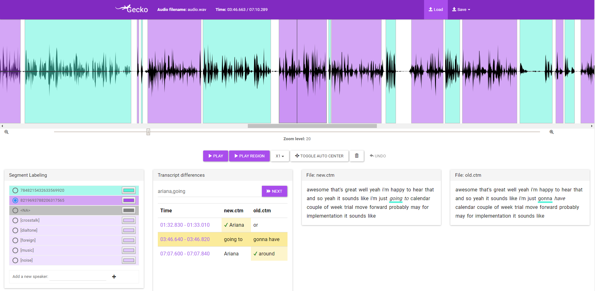

# Gecko - A Tool for Effective Annotation of Human Conversations

 Gecko allows efficient and effective segmentation of the voice signal by speaker as well as annotation of the linguistic content of the conversation. A key feature of Gecko is the presentation of the output of automatic segmentation and transcription systems in an intuitive user interface for editing. Gecko allows annotation of Voice Activity Detection (VAD), Diarization, Speaker Identification and ASR outputs on a large scale, and leads to faster and more accurate annotated datasets. 
 
 For an overview of the main features, see this [video](https://youtu.be/CBYA0YC1NBI) and the corresponding [paper](./docs/Gecko_intersepeech2019_proposal.pdf). You can also play with the online [demo](https://gong-io.github.io/gecko/).

## Features
* Supports the annotating process of different stages of a conversation: voice detection, diarization, identification and transcription.
* Provides an efficient and convenient tool for annotating audio files.
* Visualize the annotation of several different sources at once.
* Refine existing annotation files
* Compare different annotating files to find discrepancies between different systems or annotators.
* No server side is needed - easy installation.
* Supports different formats such as RTTM, CTM, JSON, CSV.
* Increased productivity using keyboard shortcuts

## Technological Stack
Gecko is written in Javascript and is based on Angular.js V1.X.
 The audio player uses the popular [wavesurfer.js](https://github.com/katspaugh/wavesurfer.js) library.

## Deployment and Installation
See [this page](INSTALLATION.md).

## Publications
Gecko will be presented in Interspeech 2019, the world's leading Speech Technology conference. See this [video](https://youtu.be/CBYA0YC1NBI) for an overview and the accepted [paper](./docs/Gecko_intersepeech2019_proposal.pdf).

## Contribution
See [this page](CONTRIBUTING.md).

## Contact

For help and feedback, please feel free to contact [the team at Gong.io](https://github.com/gong-io).
